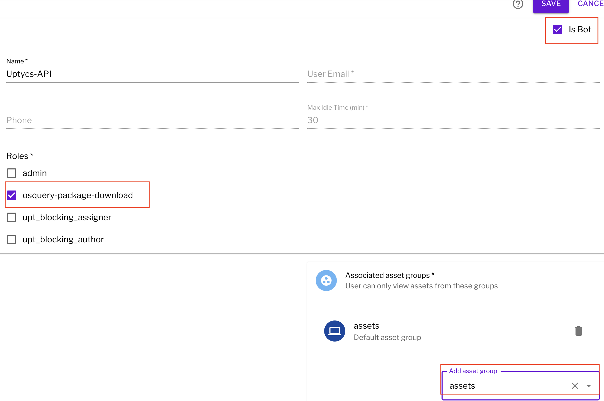
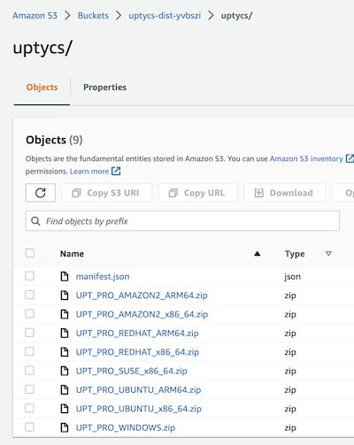
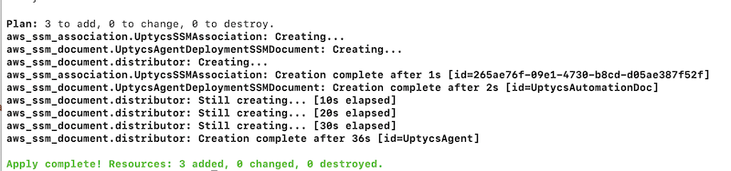
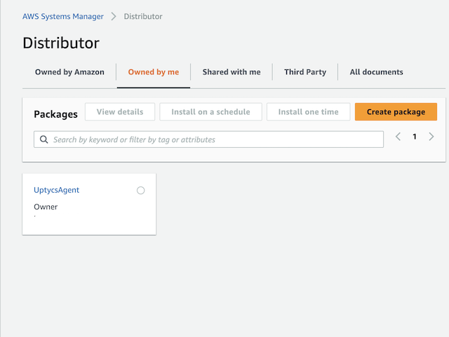
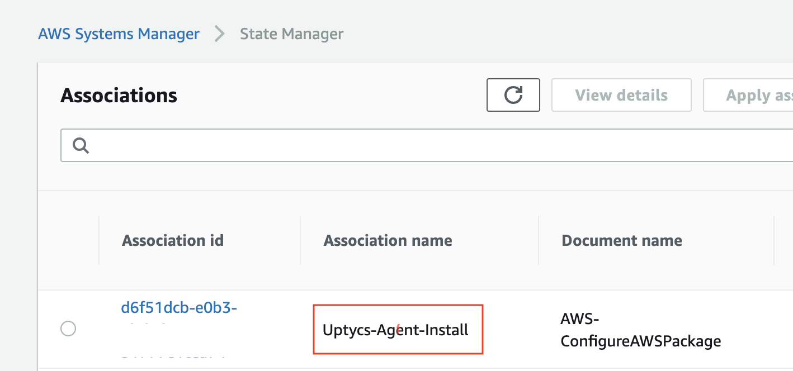
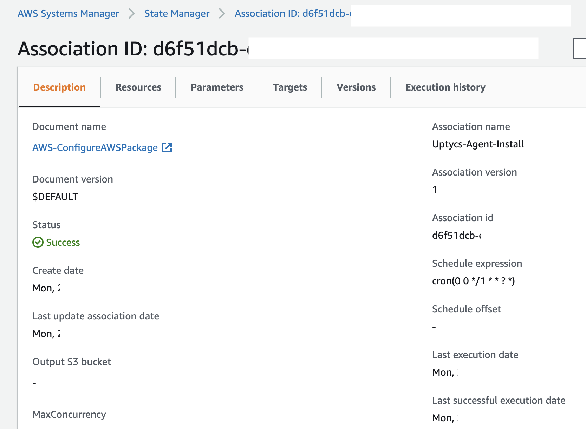
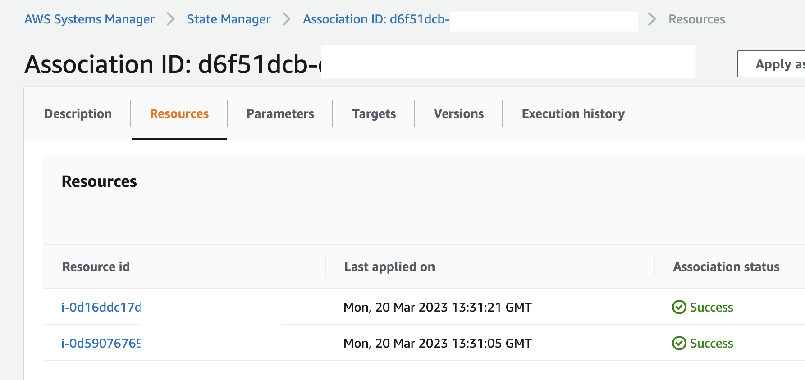

# Automating Uptycs Agent Deployment Using AWS Systems Manager

<!-- TOC -->
* [Automating Uptycs Agent Deployment Using AWS Systems Manager](#automating-uptycs-agent-deployment-using-aws-systems-manager)
  * [Overview](#overview)
  * [State Manager and EC2 Instances](#state-manager-and-ec2-instances)
  * [Solution Components](#solution-components)
    * [Prerequisites](#prerequisites)
    * [Automation scripts and Templates](#automation-scripts-and-templates)
  * [Implementing the solution](#implementing-the-solution)
    * [Clone this repository](#clone-this-repository)
    * [Create your Uptycs API credential file](#create-your-uptycs-api-credential-file)
    * [Create your distributor package](#create-your-distributor-package)
    * [Verify the Contents of the S3 Bucket](#verify-the-contents-of-the-s3-bucket)
  * [Create the Distributor Package and State Manager Association](#create-the-distributor-package-and-state-manager-association)
    * [Terraform Option](#terraform-option)
  * [Verification](#verification)
<!-- TOC -->


## Overview
This solution leverages AWS Systems Manager [AWS Automations](https://docs.aws.amazon.com/systems-manager/latest/userguide/systems-manager-state.html), 
[AWS Distributor](https://docs.aws.amazon.com/systems-manager/latest/userguide/distributor.html), and [AWS State Manager](https://docs.aws.amazon.com/systems-manager/latest/userguide/systems-manager-state.html) to 
automatically install the Uptycs Agent on EC2 Instances.

Uptycs Now supports managed distributor packages in us-east-1 and us-east-2.   If you wish to 
use Uptycs managed packages follow the guide here [Using Uptycs Distributor Packages](./supported-distributor-packages/README.md)


## State Manager and EC2 Instances

State Manager runs automatically when an instance is started or restarted, as well as on a scheduled basis according to the defined schedule. When it runs, it checks for any pending or scheduled Systems Manager documents to execute. If a document includes the installation of your Uptycs Distributor package, State Manager will install the package using Distributor only if it is not already present on the instance or if the specified version is different from the currently installed version. This feature ensures that the instance is always in the desired state and that the package is installed on all instances that match the specified tags.

## Solution Components

- Uptycs endpoint security software
  - Uptycs endpoint security software is a cloud-native, agent-based security solution designed to 
provide continuous monitoring, detection, and response capabilities for modern endpoints. It offers real-time visibility into endpoint activity, with a focus on detecting threats and suspicious behavior using advanced analytics and machine learning. Uptycs endpoint security software can help organizations improve their overall security posture by identifying and addressing security risks across their entire endpoint fleet, including laptops, servers, and cloud instances. It also provides a wide range of compliance and governance features, enabling organizations to demonstrate compliance with various regulatory requirements.

- State Manager
  - State Manager is a feature of AWS Systems Manager that helps to automate the process of keeping 
 instances in a desired state. State Manager allows users to define a set of desired configurations for an instance or group of instances, and then continuously monitor and enforce those configurations. For example, State Manager can ensure that instances are running the correct version of software, have the right permissions, and are configured according to corporate policies. State Manager helps to simplify the process of configuration management and ensures that instances are always compliant with the desired state.

- Systems Manager documents
  - Systems Manager documents are used to define the desired state of your infrastructure, and 
  State Manager uses these documents to automate the process of ensuring that instances are configured to match that state. 

- Distributor Packages
  - Distributor Packages refer to software packages that are used to distribute software and 
    updates to multiple computers or instances. Distributor Packages can be used to distribute software across an organization, or to update software on a large number of instances in the cloud. Distributor Packages can be used with tools such as Systems Manager to simplify the process of distributing and managing software across multiple instances. Distributor Packages can also be used to ensure that software is installed and updated consistently across all instances, reducing the risk of security vulnerabilities and other issues that can arise from inconsistent software configurations.


### Prerequisites
The following are required before implementing.

-  A subscription to Uptycs Platform
- An account in the Uptycs Platform with **admin** and **osquery-package-download**
- AWS CLI with the appropriate console permissions
- EC2 (Create, Run and Terminate)
- IAM (Attach roles to instances):
- S3 (Create and Delete Bucket, Upload and Download Fils ):
- State Manager (Manage Associations, Manage Packages):
- Terraform:
- Python version 3.6 or higher:
- An AWS account with at least one region enabled for host management**
   (https://docs.aws.amazon.com/systems-manager/latest/userguide/setup-instance-permissions.html)


### Automation scripts and Templates
The following scripts are provided as part of this solution. Some scripts are include only to assist with demonstrating and modifying this solution.

| Script name                  | Folder         | Description                                                                                                                                                                                                                                                                                                                  |
|:-----------------------------|:---------------|:-----------------------------------------------------------------------------------------------------------------------------------------------------------------------------------------------------------------------------------------------------------------------------------------------------------------------------|
| create_package.py          | python         | This script handles the creation of the required .zip files and manifest.json file required to build your distributor package.  The script will download the relevant rpm and deb files from the Uptycs API, place the files in the relevant folder, create the zip files and manifest file and upload them to an S3 bucket. |
| Uptycs-State-Manager.yaml  | cloudformation | A cloudformation template that will setup a <br/>stackset that creates the Distributor Package and State Manager Association in one or more regions in a single account.                                                                                                                                                     |
| Uptycs-Agent-Stackset.yaml | cloudformation | A cloudformation template that will setup a <br/>stackset that creates the Distributor Package and State Manager Association in one or more regions in a single account.                                                                                                                                                     |
| uptycs-sm-package.tf       | terraform      | Creates the Distributor Package in a single region in an account.                                                                                                                                                                                                                                                            |
| uptycs-sm-association.tf   | terraform      | Creates the State manager association in a region in an account.                                                                                                                                                                                                                                                             |
| demo-ec2-instances.tf      | terraform      | Creates an Ubuntu and AL2 instance in a VPC with Tags to demonstrate how systems manager will install the Uptycs Agent.                                                                                                                                                                                                      |

> Note: Today the terraform template setup a specific region in a single account. If you wish to 
> use multiple regions and accounts, you will need to rerun the terraform in that region and 
> account or use the cloudformation template .   We will soon release a multiaccount and 
> multiregion version of the template.

## Implementing the solution

### Clone this repository
1. Create a local copy of this solution using the git clone command.

    ```shell
    git clone https://github.com/jharris-uptycs/aws-state-manager
    ```
2. Unzip the tarball

    This will download the required files and directories for the project
    
| Directory name            | Description                                                                                            |
|:--------------------------|:-------------------------------------------------------------------------------------------------------|
| ssm-distributor-sources | Contains Folders representing each supported OS and processor architecture                             |
| terraform               | Terraform files required to build the State Manager Association and Distributor package                |                                                                            |
| cloudformation          | Cloudformation files required to build the State Manager Association and Distributor package |                                                                            |

3. Change directory to the newly created aws-state-manager directory and Install required python 
   modules
    ```shell
        pip3 install -r requirements.txt
    ```

### Create your Uptycs API credential file
Download required python packages.


### Create your Uptycs API credential file
1. Download the API Credentials file from the Uptycs console.  
In your Uptycs Console, navigate to **Settings** -> **Users** -> **Create User** 
Select **Is Bot** and add the **Assets** group to the users
Select **Save**

    

2. Place the file in the `ssm-distributor-sources` folder.  The credentials are required by the 
   script to 
download the files from the Uptycs API and place them in the correct folder. 

### Create your distributor package

The `create_package.py` script will use information in the `agent_list.json` file to build zip 
files and a manifest.json file place them in a local s3-bucket folder and then upload them to an S3 bucket in your account. 
More information about the python script [here](additional-documents/CREATE-PACKAGE.md)

1. Navigate to the `ssm-distributor-sources` folder and execute the `create_package.py` script.

    > Note: It is possible to create a custom distributor package, more information is provided [here](.
    > /additional-documents/CUSTOM-PACKAGES.md).
   
2. Run the create_package.py script 
    ```shell
        cd ssm-distributor-sources
        python3 ./create_package.py -c <my-credentials-file> -b <my-bucket> -r <aws-region>   
    ```
   
    >Note: 
    **Mandatory Command line Arguments**
    > 
    > -c <my-credentials> The path to the credentials file that you downloaded in the previous section 
     [Create your 
     Uptycs API credential file](###Create your Uptycs API credential file)
    > 
    > **Optional Command line Arguments**
    > 
    >-b <my-bucket> The name of the S3 Bucket that you are going to create in your account. 
    >
    > -r <aws-region>  The region where the S3 bucket will be created.

    The script will proceed and you can monitor the progress in the console
    example output below (truncated output)

    
    <p align="left">Figure 1: Python script output</p>
   
### Verify the Contents of the S3 Bucket

1. In your AWS Console navigate to **S3** -> **bucket name** and verify the contents of the bucket

    

## Create the Distributor Package and State Manager Association

You may now choose to setup the Distributor Package and State Manager Association 
[terraform](#terraform-option)  or [cloudformation](./additional-documents/CLOUDFORMATION.md)

### See the Cloudformation document [here](./additional-documents/CLOUDFORMATION.md)

### Terraform Option

The diagram below shows the resources created by this terraform project.
The terraform project creates the State Manager Association and the Systems Manager Distributor 
Package.


    
1. Move to the terraform folder
   
    Examine the variables.tf and the setup.tfvars files and modify as required.   You will be 
   required to enter the 
       bucket name as a minimum.
    
    | Variable Name              | Default Value                                     | Type        | Description                                                                                              | 
    |:---------------------------|:--------------------------------------------------|:------------|:---------------------------------------------------------------------------------------------------------|
    | UptycsEc2TargetTagKeyName  | UPTYCS-AGENT                                      | string      | EC2 Tag Name                                                                                             | 
    | UptycsEc2TargetTagKeyValue | TRUE                                              | string      | EC2 Tag Value                                                                                            |
    | path_to_manifest           | "../s3-bucket/manifest.json"                      | string      | Path to manifest file                                                                                    |
    | package_name               | "UptycsAgent"                                     | string      | Name of the Distributor Package                                                                          |
    | s3_bucket_name             | ""                                                | string      | Name of the S3 bucket where the zip files and manifest files are staged                                  |
    | Action                     | "Install"                                         | string      | Action that the AWS-ConfigureAWSPackage Document will take                                               |
    | AdditionalArgs             | "{}"                                              | string      | Additional arg (At this time there are no additional parameters required)                                |
    | aws_region                 | "us-east-1"                                       | string      | Region that your resources will be created in                                                            |
    | create_instance            | false                                             | string      | Creates two test EC2 instances in a VPC correctly tagged so that state manager installs the Uptycs Agent |                                                                  |

    A seperate tfvars file is also included that contains the most common variables that you may 
    wish to modify

    > Note: the folder also contains the file demo-ec2-instances.tf.txt.  This file will build a VPC 
    > with Amazon Linux 2 and Ubuntu instances that are have been tagged so that state manager will 
    > install the Uptycs agent automatically.  If you wish to observe this behaviour the set the 
    > **create_instance** variable to **true** in the tfvars file.

2. Review the .tfvars file and enter the required variables 


3. Type the command to initialise terraform and download the required terraform providers
     ```
     terraform init
     ```
    This installs the required provider plugins, initializes the backend configuration, and installs 
    any modules specified in the configuration. It also verifies that the configuration is valid and that all the dependencies are installed. 

5. Type the command to create a plan of the resoureces you will create 
    ```
    terraform plan
    ```
    From reviewing the output you should see 3 resources to create
    >Note If you are also creating the EC2 instances you will see 12 resources
   
6. Type the command to create the resources 
    ```text
    terraform apply -var-file=setup.tfvars --auto-approve
    
    ```

    
    <p align="left">Figure 1: Terraform output</p>

7. Proceed to the [verification](##Verfication) section


## Verification

1. In your AWS Console, navigate to **Systems Manager** -> **Distributor** -> **Owned by me** 
   and confirm that the package created successfully.

    


2. In your AWS Console, navigate to **Systems Manager** -> **State Manager** -> **Owned by me

   * State Manager Association

    
   

3. Select the history tab to view the association history 

    


4. Select the instances tab to view the instances that the association has been applied to. 

    


