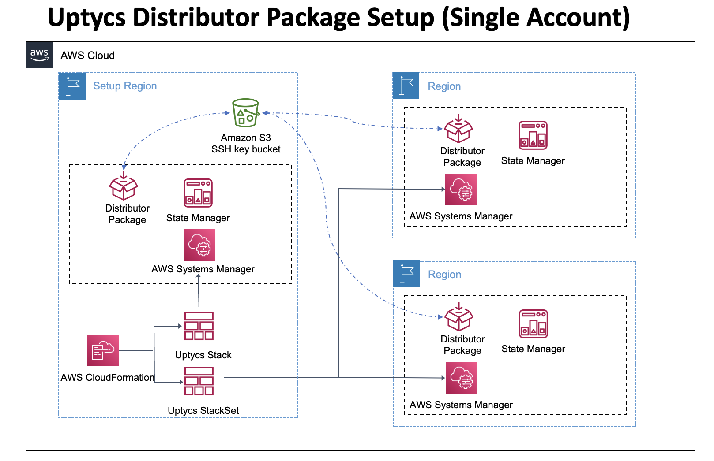
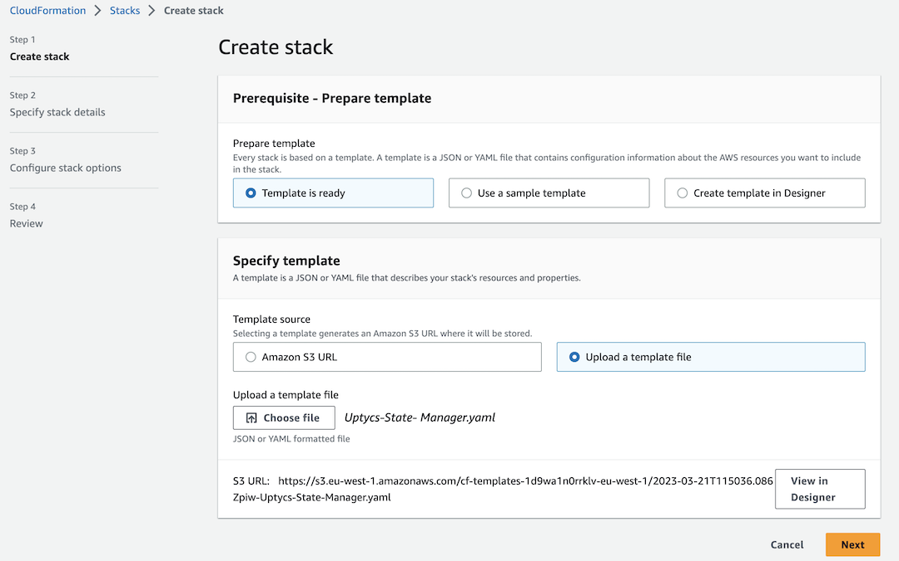
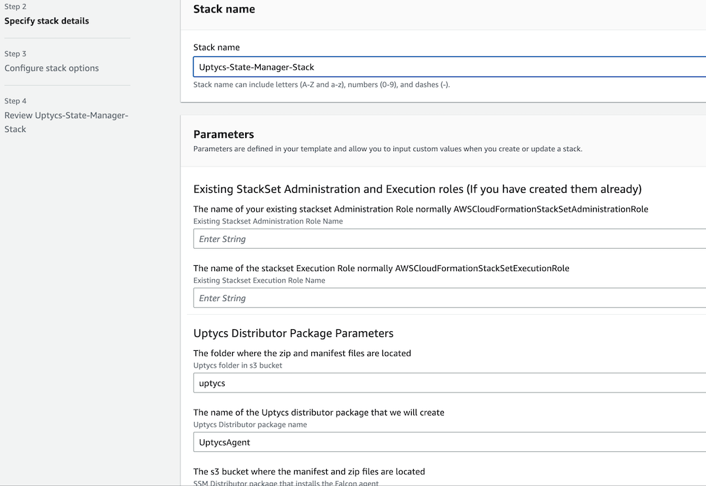
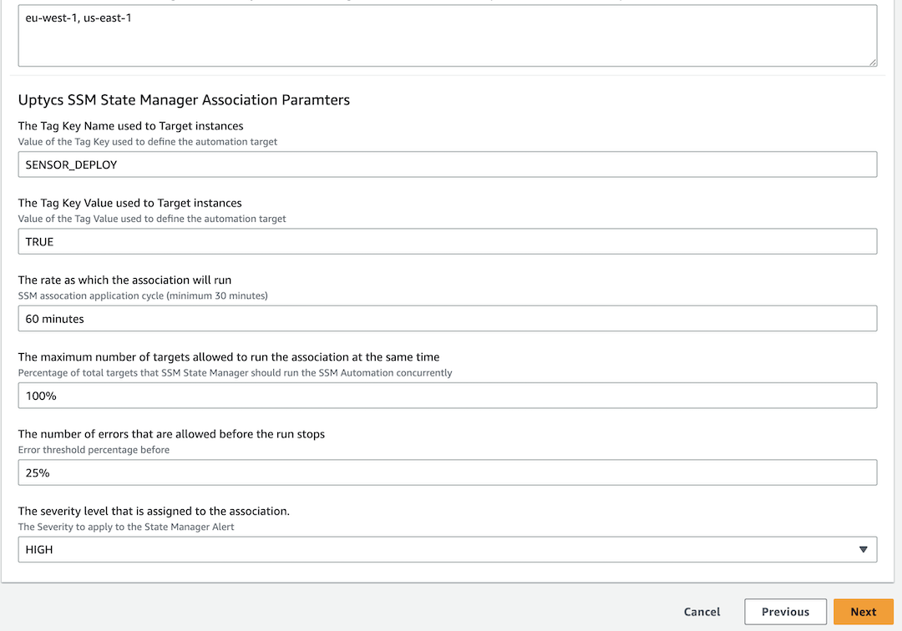
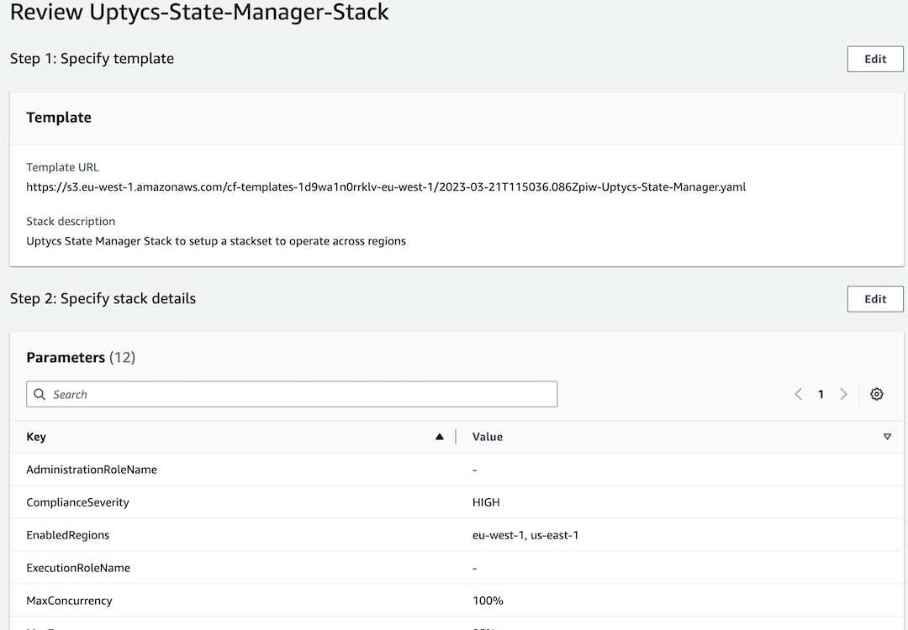
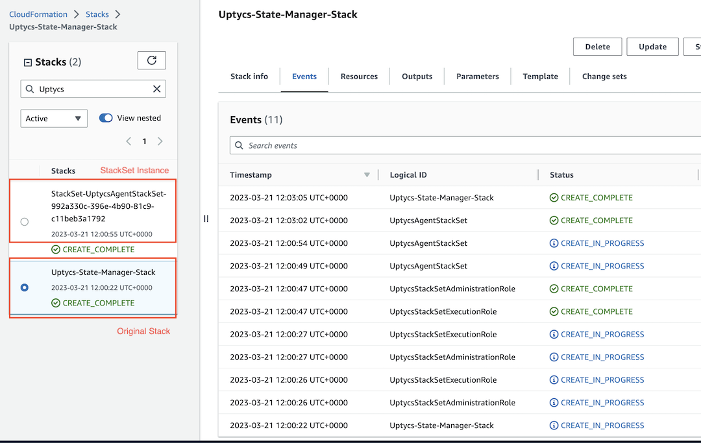
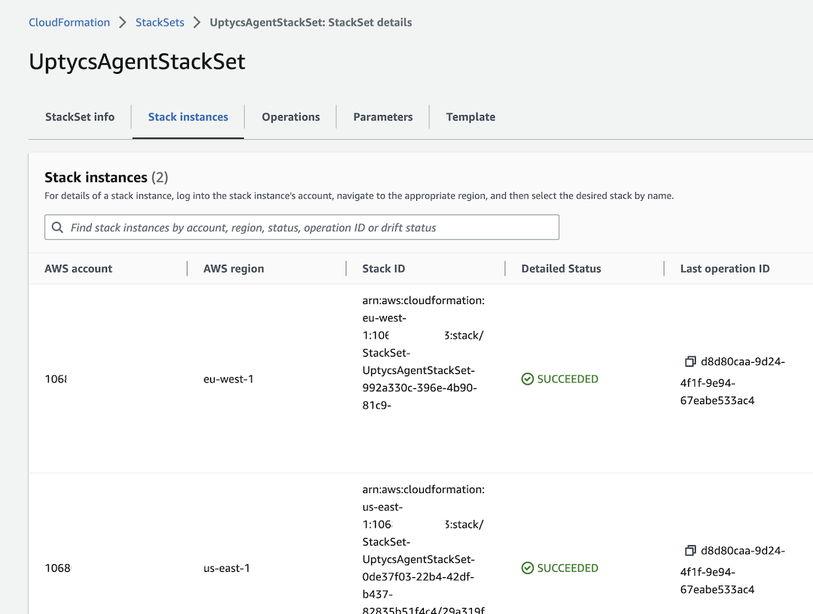

# Automating Uptycs Agent Deployment Using AWS Systems Manager
## Cloudformation Option

### Deploy the stack via CloudFormation
The `Uptycs-Stage-Manager.yaml` template creates a Uptycs Distributor package and a State 
Manager Association in multiple regions in your account.  
You can deploy this template using the AWS Console or the command line.

The diagram below shows the setup process.
The template will create the distributor package and State Manager Association in the home 
region together with a SELF_MANAGED StackSet that can be applied to all other regions. 




#### Parameters
This CloudFormation has the following parameters.

| Parameter Key            | Description                                                                                                                                                                  | Type               | Default       | Allowed Values                                |
| ------------------------|------------------------------------------------------------------------------------------------------------------------------------------------------------------------------| -------------------|---------------| --------------------------------------------- |
| AdministrationRoleName  | Existing Stackset Administration Role Name                                                                                                                                   | String             | N/A           | N/A                                           |
| ExecutionRoleName        | Existing Stackset Execution Role Name                                                                                                                                        | String             | N/A           | N/A                                           |
| UptycsSsmPackageBucketFolder | Uptycs folder in s3 bucket                                                                                                                                                   | String             | uptycs        | N/A                                           |
| UptycsSsmPackageName         | Uptycs Distributor package name                                                                                                                                              | String             | UptycsAgent   | N/A                                           |
| UptycsSsmPackageBucket       | SSM Distributor package that installs the Falcon agent                                                                                                                       | String             | N/A           | N/A                                         |
| UptycsAgentTargetKey          | Value of the Tag Key used to define the automation target                                                                                                                    | String             | SENSOR_DEPLOY | N/A                                           |
| UptycsAgentTargetValue        | Value of the Tag Value used to define the automation target                                                                                                                  | String             | TRUE          | N/A                                           |
| UptycsScheduleRate            | SSM assocation application cycle (minimum 30 minutes)                                                                                                                        | String             | 60 minutes    | N/A                                           |
| MaxConcurrency               | Percentage of total targets that SSM State Manager should run the SSM Automation concurrently                                                                                | String             | 100%          | N/A                                           |
| MaxErrors                    | Error threshold percentage before                                                                                                                                            | String             | 25%           | N/A                                           |
| ComplianceSeverity           | The Severity to apply to the State Manager Alert                                                                                                                             | String             | UNSPECIFIED   | CRITICAL, HIGH, LOW, MEDIUM, UNSPECIFIED      |
| EnabledRegions               | "Enter a comma-delimited list of regions where you would like the Uptycs package to be visible. For example:"us-east-1,eu-central-1,ap-south-1\"." | CommaDelimitedList | N/A           | N/A                                           |

#### Deployment
AWS supports console or command line deployment for this solution.

- [AWS CLI deployment](#aws-cli-deployment)
- [AWS Console deployment](#aws-console-deployment)

##### AWS CLI deployment
You can deploy this stack using the AWS CLI from this folder using the following command.
Only required parameters are shown below, additional parameters may be added from the table above as necessary to meet the needs of your environment.

Example AWS cli command
```shell
aws cloudformation create-stack --stack-name 'Uptycs-State-Manger' \
  --template-body file://Uptycs-State-Manager.yaml \
  --parameters ParameterKey=UptycsSsmPackageBucketFolder,ParameterValue='my-bucket-name' \
    ParameterKey=EnabledRegions,ParameterValue='eu-west-1' \
    ParameterKey=ComplianceSeverity,ParameterValue='HIGH' \
  --region 'eu-west-1' --capabilities CAPABILITY_NAMED_IAM
```

##### AWS Console deployment
To deploy this stack using the AWS console, follow the procedure below.

1. In your AWS Console, navigate to **CloudFormation** -> **Create stack** -> **With new resources (standard)**

2. Under **Specify template**, select **Upload a template file** and upload the 
   `Uptycs-State-Manager.yaml` from the cloudformation folder, then click **Next**
   

3. Provide a **Stack name** and update the **Parameters** if the default values do not match your deployment:
   

4. Modify the Uptycs tags if required and add the region list as required **Next**.
   

5. Review your selections, and accpet the IAM warning `I acknowledge that AWS CloudFormation might 
   create IAM resources with custom names` check box. After doing so, click the **Create Stack** button.
   

6. Your stack will now start to deploy.
   Once completed your should see your original stack and also and an additional stack instance 
   from your stackset if you included this region in your regions list
   

7. Verify that the stackset has been created and that the stack instances have been created.
   


> It takes approximately 3 minutes to create the stack. 