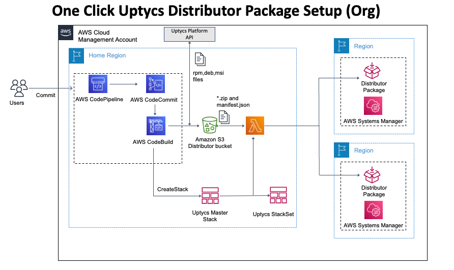
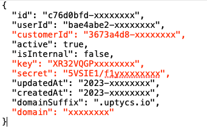
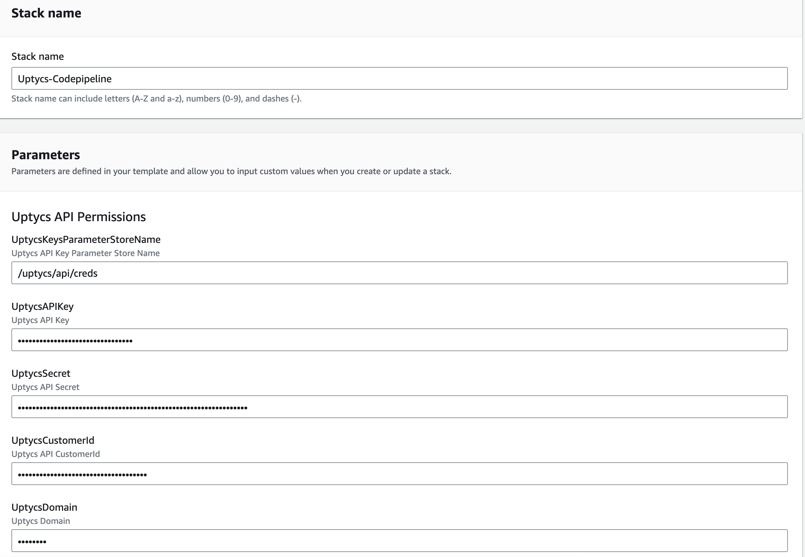
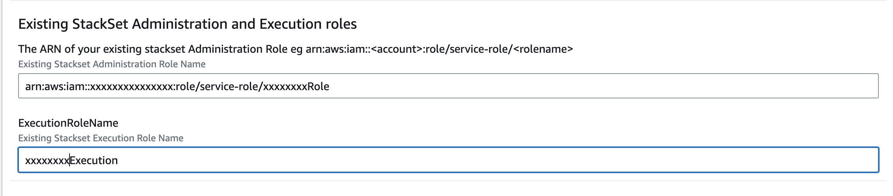
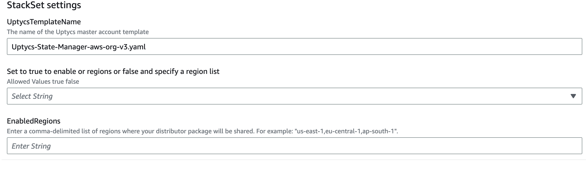
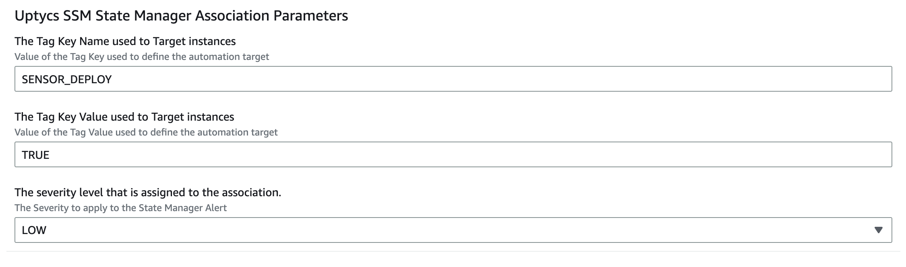

## Background
This template demonstrate the combined use of DevOps automation and Infrastructure as Code (IaC) 
via AWS CodePipeline AWS CloudFormation automate the management and deployment of the Uptycs 
osquery agent across multiple accounts and regions.


This template will deploy this solution in a multi account AWS Organization.

## Prerequisites
When an AWS Organization is created, AWS automatically creates a set of cross-account roles that enable organizations to manage and administer multiple accounts from a central location. These roles are created in the management account and are used to delegate administrative access to member accounts. The roles include the OrganizationAccountAccessRole, which enables the management account to access member accounts, and the OrganizationViewOnlyAccessRole, which grants read-only access to member accounts.


You can find more information on StackSet administration and execution roles on the AWS 
documentation page:

[AWS CloudFormation StackSets Administration and Execution Roles](https://docs.aws.amazon.com/AWSCloudFormation/latest/UserGuide/stacksets-prereqs-admin-role.html)

> Note: This solution assumes that you have an existing organization with the required cross 
> account roles. 


## Automation Components

 Cloudformation template creates the following resources
- CodePipeline 
    - CodeBuild Project
    - CodeBuild Repository
- S3 Bucket for package source files (zip files and manifest)
- Lambda function (Creates and Shares packages with member accounts in multiple regions)
- StackSet (Creates State Manager Associations in member accounts)


## Automation Process

The Diagram below shows the setup process 



* Step 1 - CloudFormation creates the AWS CodeCommit repository.
* Step 2 - Write the Uptycs API credentials to SSM parameter store for secure storage
* Step 3 - Initial commit triggers the CodePipeline which triggers the pipeline defined in the 
[distributor-buildspec.yaml](../codepipeline/distributor-buildspec.yaml) file.
* Step 4 - Codebuild executes [codepipeline_create_package.py](../codepipeline/ssm-distributor-sources/codepipeline_create_package.py) which downloads the rpm, 
  deb and msi files and creates the required zip and manifest.json files.
* Step 5 - Uptycs package zip and manifest files are moved to the staging bucket
* Step 6 - Codebuild loads a [CloudFormation template](../cloudformation/Uptycs-State-Manager-aws-org-v3.yaml) that creates a lambda function which 
  creates the Uptycs distributor packages in the desired regions and shares them with all 
  organization member accounts.


## Setup

### Clone this repository
1. Create a local copy of this solution using the git clone command.

    ```shell
    git clone https://github.com/uptycslabs/aws-systems-manager/
    
    ```
### Create your Uptycs API credential file

 Download the API Credentials file from the Uptycs console.  
 In your Uptycs Console, navigate to **Settings** -> **Users** -> **Create User** 
 Select **Is Bot** and add the **Assets** group to the users
 Select **Save**

    


### Gather required Parameters
The CloudFormation template accepts the following input Parameters.  


| Parameter Name               | Type  | Description                                                                                                                              | Required                                       |
|------------------------------|-------|------------------------------------------------------------------------------------------------------------------------------------------|------------------------------------------------|
| UptycsAPIKey                 | String | Uptycs API Key (NoEcho)                                                                                                                  | Yes                                            |
| UptycsSecret                 | String | Uptycs API Secret (NoEcho)                                                                                                               | Yes                                            |
| UptycsCustomerId             | String | Uptycs API CustomerId (NoEcho)                                                                                                           | Yes                                            |
| UptycsDomain                 | String | Uptycs Domain (NoEcho)                                                                                                                   | Yes                                            |
| AdministrationRoleArn        | String | Existing Stackset Administration Role Name                                                                                               | Yes                                            |
| ExecutionRoleName            | String | Existing Stackset Execution Role Name                                                                                                    | Yes                                            |
| EnableAllRegions             | String | Allowed values: true, false                                                                                                              | Yes                                            |
| EnabledRegions               | String | Enter a comma-delimited list of regions where your distributor package will be shared. For example: "us-east-1,eu-central-1,ap-south-1". | Required if you selected false for All regions |
| ComplianceSeverity           | String | The Severity to apply to the State Manager Alert. Allowed values: CRITICAL, HIGH, LOW, MEDIUM, UNSPECIFIED.                              | Yes                                            |
| Optional Parameters          |       |                                                                                                                                          |                                                |
| UptycsTemplateName           | String | The name of the Uptycs master account template                                                                                           | Do not change                                  |
| UptycsAgentTargetKey         | String | Value of the Tag Key used to define the automation target                                                                                | No will use default if not selected            |
| UptycsAgentTargetValue       | String | Value of the Tag Value used to define the automation target                                                                              | No will use default if not selected            |
| UptycsKeysParameterStoreName | String | Uptycs API Key Parameter Store Name                                                                                                      | No will use default if not selected            |
| RepositoryName               | String | CodeCommit Repository for Uptycs CloudFormation templates                                                                                | No will use default if not selected            |
| RepositoryDescription        | String | CodeCommit repository description                                                                                                        | No will use default if not selected            |
| BranchName                   | String | Branch in the CodeCommit Repository for Uptycs CloudFormation templates                                                                  | No will use default if not selected            |
| UptycsSsmPackageBucket       | String | Prefix for the S3 Staging Bucket that stages the code copied from code commit                                                            | No will use default if not selected            |
| S3CodeBucketName             | String | Name of the S3 bucket with the initial commit of code                                                                                    | No will use default if not selected            |
| S3Prefix                     | String | Prefix for file path                                                                                                                     | No will use default if not selected            |
| S3CodeBucketKey              | String | Key of the S3 bucket with the initial commit of code                                                                                     | No will use default if not selected            |

1. Extract the required API credentials from the credentials file 
    Open that you saved in the previous step 
    Extract the credentials shown in red

     
2. Gather the Existing StackSet Administration role ARN and Execution role Name from the AWS 
   console 

3. Load the cloudformation template 
    Console Method
    
    Load the template `uptycs-codepipeline_v3.yml` from the Cloudformation folder. 
    
    Enter the stackset params
    
4. Enter the StackSet Administration Role ARN and StackSet Execution role name
    
5. Enter regions where you would like to stacksets to operate
    Select true or false for enable all regions
    Enter a region list if you have selected false for all regions
    
6. Enter the required State Manager Association values
    These tag key value pairs are the tags are the target tags for the state manager association
       
    
