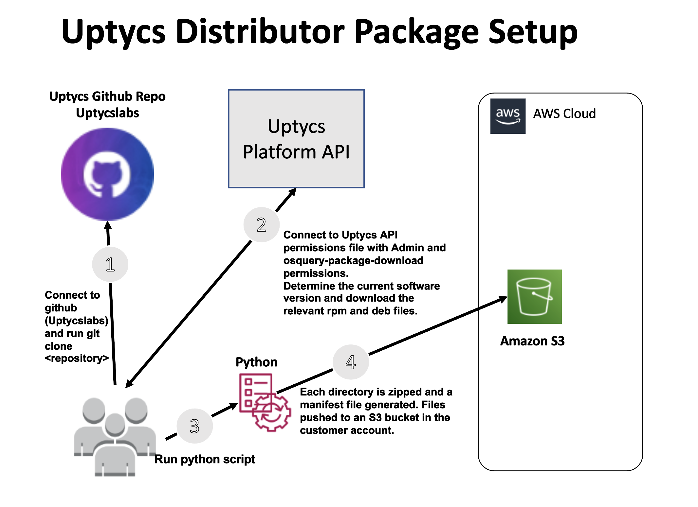

You will find a `create_package.py` in the `ssm-distributor-sources` folder.
The script automates the process of creating installable assets zipped with installation and 
uninstallation scripts, and a JSON manifest file, to an Amazon S3 bucket. See the following page 
for more information https://docs.aws.amazon.com/systems-manager/latest/userguide/distributor-working-with-packages-create.html#distributor-working-with-packages-create-adv

The diagram above show the tasks performed by the python script.  They can be summarized as 
1) Connect to the Uptycs API 
2) Determine the current version of the Uptycs Sensor
3) From the required rpm and deb files required from the `uptycs-agent-mapping.json` file
4) Download the relevant files and place them into the relevant folder under the 
   ssm-distributor-sources folder.
5) Create a zip file of the files in each folder under the ssm-distributor-sources folder
6) Generate a manifest.json file 
7) Upload the files to an S3 bucket

First create an AWS Systems Manager Distributor Package which contains the required Uptycs 
software together with the required install and uninstall scripts.