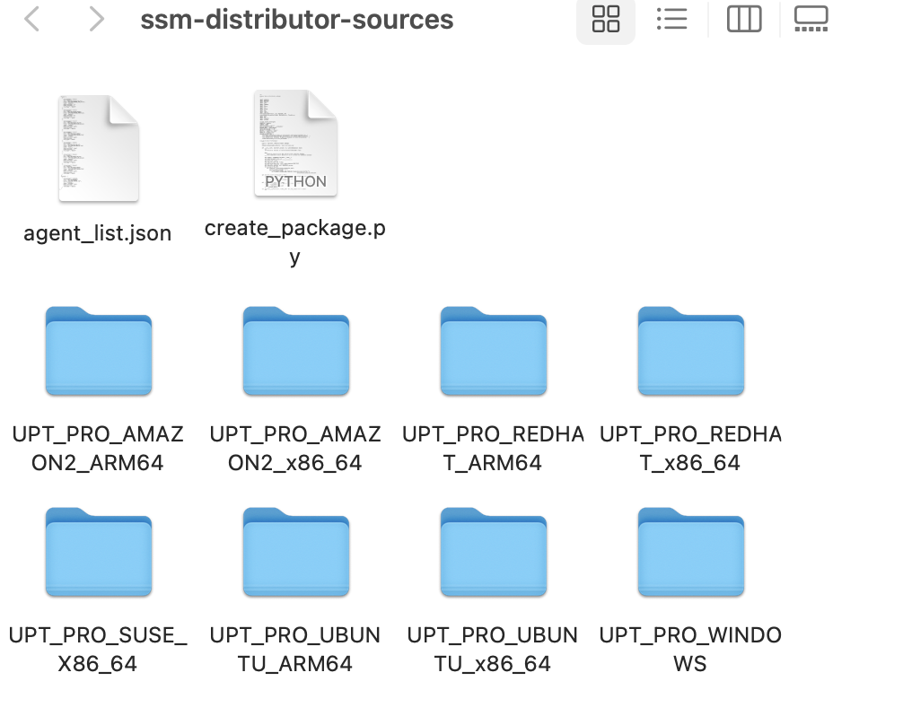

## Creating AWS Distributor Packages

The provided script `create_package.py` automates Steps 1-3 outlined [here](https://docs.aws.amazon.com/systems-manager/latest/userguide/distributor-working-with-packages-create.html#distributor-working-with-packages-create-adv) 

The script has the capabilities to perform the following actions. 

- Download the required rpm and deb files via the Uptycs API
- Create the ZIP files 
- Generates the `manifest.json` files 
- Uploads the package and manifest to an Amazon S3 bucket

The script will perform 
all these actions by default however various command line options exist to modify the default behaviour if required

If you wish to create a version of distributor to support either a subset of operating systems 
and cpu architectures you may modify the `uptycs_agent_mapping.json` file adding or removing 
entries and directories as required. See [here](#the-uptycs-agent-mappingjson-file) for more information


## The `create_package.py` File
There are a number of command line options available
The only mandatory option is the -c option 

Parameter Description


| Argument                                               | Description                                                                                                                                            |
|:-------------------------------------------------------|:-------------------------------------------------------------------------------------------------------------------------------------------------------|
| -h, --help	                                            | show this help message and exit                                                                                                                        |
| -c CONFIG, --config CONFIG	                            | REQUIRED: The path to your auth config file downloaded from Uptycs console                                                                             |
| -b S3BUCKET, --s3bucket S3BUCKET	                      | OPTIONAL: Name of the S3 bucket used to stage the zip files                                                                                            |
| -p PACKAGE_NAME, --package_name PACKAGE_NAME	          | OPTIONAL: Use with -d to specify the name of the distributor Package that you will create using files .rpm and .deb files that you have added manually |                                                                                                                                               |
| -r AWS_REGION, --aws_region AWS_REGION	                | OPTIONAL: The AWS Region that the Bucket will be created in                                                                                            |
| -v PACKAGE_VERSION, --package_version PACKAGE_VERSION	 | OPTIONAL: Use with -d to specify set the Osquery Version if you have added the files manually in the format eg 5.7.0.23                                |                                                                                                                                               |
| -d, --download	                                        | OPTIONAL: DISABLE the download install files via API. Use if you are adding the rpm and .deb files to the directories manually                         |                                                                                                                                               |
| -o, --sensor_only	                                     | OPTIONAL: Setup package without Uptycs protect. By default the Uptycs Protect agent will be used                                                       |
    


The options -d, -v and -p exist to allow the user to manually add the relevant .rpm and .deb 
files to the folders if they wish to use older versions of the Uptycs package.

Examples

Build a package specifying the buckset prefix

``` create_package.py -c <api keys file> -b <bucket name prefix> ```


Build a package without downloading source files from the internet (Add the deb and rpm files 
manually)

``` create_package.py -c <api keys file> -v <osquery version eg 5.7.0.25> -d  ```

Create a package without Uptycs protect

```create_package.py -c <api keys file> -o```

## The `uptycs-agent-mapping.json` File

The agent_list.json file in the `ssm-distributor` folder contains a JSON object with two 
top-level 
keys, "linux" and "windows". Under "linux", there is an array of objects, where each object represents a supported Linux distribution. 
These objects have the following properties:

   + "upt_package": the name of the Uptycs package that corresponds to this Linux distribution.
   + "id": a unique identifier for the Linux distribution (e.g. "amzn2" for Amazon Linux 2).
   + "dir": the name of the directory that contains the Uptycs package for this distribution.
   + "name": the name of the Linux distribution (e.g. "amazon", "redhat", "suse").
   + "major_version": the major version number of the Linux distribution (e.g. "2", "_any").
   + "minor_version": the minor version number of the Linux distribution (e.g. "", "6.9").
   + "arch_type": the processor architecture of the Linux distribution (e.g. "x86_64", "arm64").

Under "windows", there is an array with a single object that represents the supported Windows operating system. 
This object has similar properties as the Linux objects, except "id", which is not used for Windows.


## Modifying the Install and Uninstall Files
Review the install and uninstall files if required so that they meet your needs The following directories contain the relevant **install** and **uninstall** files for each package:

Once the python script has completed
You will also find directories containing the install and uninstall files for each OS and CPU 
architecture supported today. 

